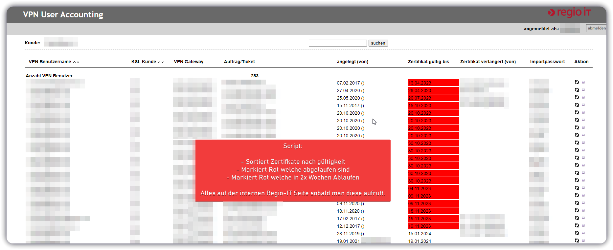

# itis-regioit
Tampermonkey script to sort the VPN List, showing which VPNs will expire first.

## How to install
1 - First download and install [Tampermonkey](https://www.tampermonkey.net/)

2 - Then import this script, there are many ways to do this, one is just open Tampermonkey (the extension) and go to Utilities -> Import from URL and use this [Install Link](https://github.com/Zuescho/itis-regioit/raw/main/Sort%20VPN%20Users%20by%20Certificate%20Expiry.user.js)  
(you can also try just clicking it after you installed tampermonkey.)

3 - Visit [https://itis.regioit.intern/vua/index.php?content=vpnuser&customer=0&&rowsPerPage=400](https://itis.regioit.intern/vua/index.php?content=vpnuser&customer=0&&rowsPerPage=400)  

It should now sort it for you.  

If you don't always want to remember to visit the above site, import this second script which will add an redirect button to the normal VPN overview site.  
[Install Link](https://github.com/Zuescho/itis-regioit/raw/main/Redirect%20Button%20for%20ITIS.user.js)  

